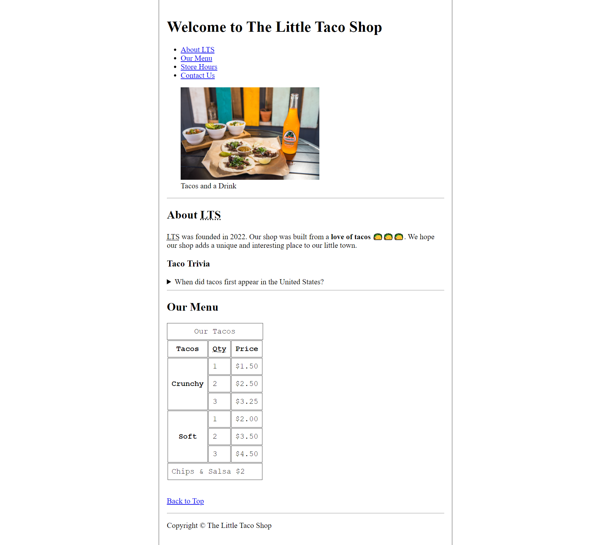
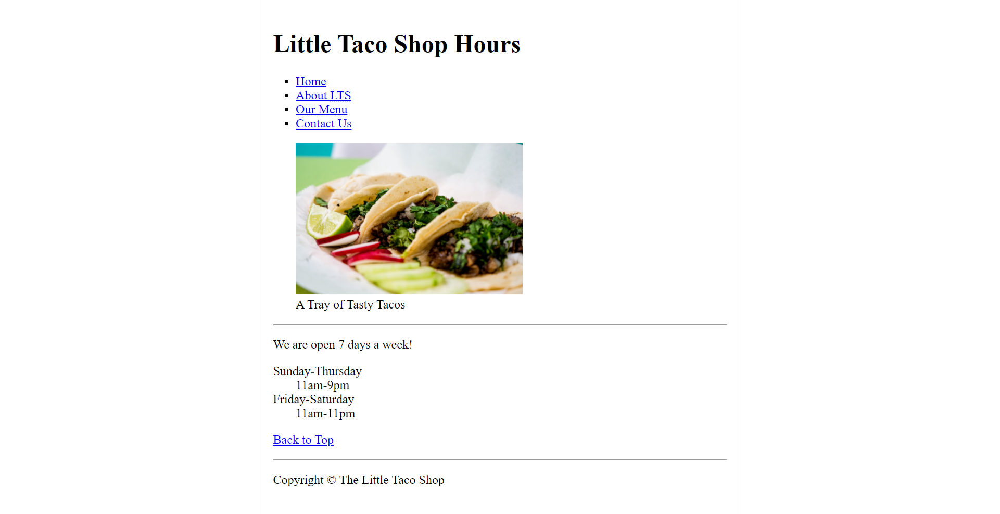

# "HTML Project"

This project is built from [dave gray](https://www.youtube.com/watch?v=kUMe1FH4CHE&t=12744s&ab_channel=freeCodeCamp.org) **Learn HTML Course For Beginners**, which I used to revise my HTML5 concepts. The project consists of three pages home, contact-us and hours page.

## Screenshots

Home Page

Hours Page

Contact Us

